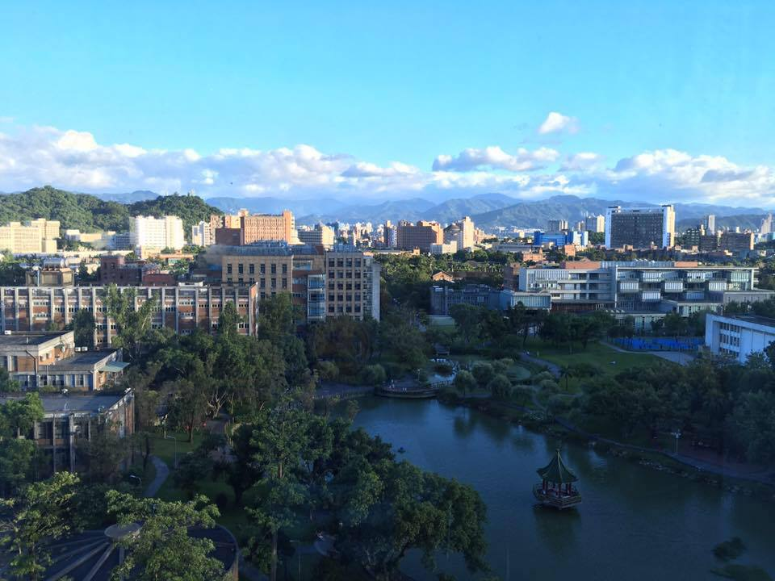

Roger Chi-Jen Lo (羅啟仁) lives in Taipei, Taiwan. He is a M.S. student in the <a href="https://comm.ntu.edu.tw">Graduate Institute of Communication Engineering, National Taiwan University</a>; he received his B.S. degree from the <a href="https://web.ee.ntu.edu.tw/">Department of Electrical Engineering, National Taiwan University</a>. He is recently under the mentorship of <a href="http://www.ee.ntu.edu.tw/profile?id=76">Prof. Tsung-Nan Lin</a>, doing research of Deep Neural Network. For any other details, just survey this website, or feel free to contact him via email: <a href="mailto: intelisef47@gmail.com">intelisef47@gmail.com</a>. Have a nice day!

